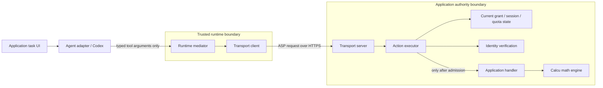

# SDK architecture proposal

Status: design draft, not an implemented API or a conformance claim.

The [first boundary contract](boundary-contract.md) compares Calcu with the pinned
RFC and defines the next SDK + Calcu vertical slice and its acceptance cases.

The SDK should remove repeated ASP boundary code from applications without
absorbing their business logic or the agent's internal execution model. Start
with one Node.js package and one consumer (Calcu). Build reusable validated
behavior in the SDK and adopt it in Calcu incrementally; do not require a full
handwritten Calcu implementation before SDK work begins.

## Security-first, SDK-assisted adoption

Owner direction recorded 2026-09-11: simplify integration, not ASP guarantees.
Separate the one-time cost of engineering the security implementation from the
cost of connecting each application. Calcu is a first integration consumer and
source of behavioral evidence, not the normative source or a future bulk import.

The [ASP ADP backlog](https://github.com/0al-spec/agent-surface/blob/main/review/adoption-delivery-backlog.md)
owns task status, scope approvals and cross-repository ordering; its companion
SDK-first revision is in [ASP PR #90](https://github.com/0al-spec/agent-surface/pull/90).
This file owns architecture; [boundary-contract.md](boundary-contract.md) owns
the selected/planned slice and acceptance cases. Neither is another task tracker. Early
SDK behavior accompanies ADP-05…07; ADP-09 later stabilizes the public API and
tests reuse with a second consumer. Plans do not add implemented exports,
advance the source lock or prove conformance.

## What exists today

`JsonDocument`, `CanonicalObjectHash`, and `SurfaceSnapshot` implement strict JSON
input handling and selected canonical hashing behavior. `SurfaceSnapshot.hash()`
does not validate a full manifest or grant authority. Hash equality alone does
not authenticate a publisher, authorize an action, or prove user intent.

[spec-lock.json](../spec-lock.json) pins ASP revision
`b2d7e3627a08ec40ed7c0fd2f76370acc1c7e691` and verifies Core, Authorization, Privacy
and Evidence. The [compatibility review](compatibility/user-managed-source-update.md)
records the explicit revision update for the Hello fixture's `user_managed`
grammar. Hashing behavior is unchanged; this does not implement planned
manifest/Grant or handling enforcement contracts. Any further source or
revision change needs explicit compatibility review and validator/tests.
Do not silently advance the pinned revision or claim that the current lock
covers all future components.

## Target execution boundary

The following components are proposed roles, not existing exports. Arrows are
calls; results return along the same path, including executor to mediator and
mediator to agent adapter.

Issuance is a separate control path: a trusted application authorization decision
feeds the Grant issuer, which verifies evidence and establishes authoritative
Grant/session state. A credential reaches the trusted runtime over the chosen
provisioning channel, never via tool arguments or the task UI. The issuer is not
an agent-callable tool; the SDK cannot manufacture user authorization.

For the initial Compatibility Bearer development profile, the trusted runtime
holds the raw credential and the application store keeps its verifier hash.
Transport sends the credential in the authorization header, not the JSON body.
This is not a promise about every future credential profile or production trust.

These module boundaries describe responsibilities, not a JavaScript sandbox.
The host must isolate untrusted agent code and protect the credential-bearing
runtime; a malicious dependency in the same privileged process is outside the
protection provided by TypeScript interfaces or private fields.

## Responsibilities and dependency direction

| Component | Responsibility | Must not do |
| --- | --- | --- |
| JSON / canonical values | Preserve raw input checks, select exact hash views and domains | Treat a valid hash as authority |
| Manifest / Grant objects | Validate supported wire contracts, retain immutable bindings | Pretend unsupported profiles were checked |
| Grant issuer | Apply trusted authorization policy and verified identity to issuance | Accept an agent-supplied identity string as evidence |
| Session / authority state | Own lifecycle, generation and quota across calls | Reset quota when a mediator is recreated |
| Action executor | Admit against current authority, schema and application policy; then dispatch | Trust the mediator's admission decision |
| Runtime mediator | Construct bound requests and validate result correlation/schema | Let tool arguments choose credential or authority tuple |
| Transport adapters | Enforce transport authentication, framing, limits and cancellation | Supply business authorization or evaluate inputs |
| Application handler | Implement domain behavior and application-state checks | Rely on model prose as approval |
| Agent adapter | Translate provider tool calls into the narrow mediator API | Import the application's handler or bypass transport |

Domain objects depend on narrow behavioral interfaces. Concrete transport,
storage, clock and identity-verification implementations depend on those
interfaces, not the other way around. A composition root in the host wires them
together. Do not build a global registry, service locator or generic plugin
framework for this first consumer.

### Optional, bidirectional application composition

Owner-endorsed direction, 2026-09-11: the
[config-first Hello composition](../examples/design/hello-composition/README.md)
captures roughly 80% of the desired integration experience. That is a design-fit
assessment, not implementation progress. Preserve this reference while evolving
the API; names, signatures, package boundaries and deployment details remain
provisional. It does not change the selected Calcu contract or ADP gates.

The native application remains useful without ASP. It owns private domain
behavior and deliberately exposes narrow incoming ports to its trusted executor.
Public methods are not automatically tools. An ordinary ASP manifest and JSON
Schemas declare the surface; a separate, exact handler map connects action IDs
to those ports. Configuration is data, not a second DSL or executable handler
loader. Host setup is shared across operations, not repeated per method.

The application also owns an outgoing interface, `GreetingAssistant` in the
example. Its implementation is a local facade, not the agent: it asks a bound
session to deliver an authorized `greeting.requested` event. The runtime requests
the exact-Grant subscription and decides whether to start work under user/local
policy. This is not permission for the app to inject content into `session.start`
or command arbitrary agent methods. An event acknowledgement is not task success.

The real agent integration belongs in an explicit provider adapter, shown as a
future `CodexAgentAdapter`. The host supplies only a per-work mediator port to
that adapter. Calls go through the runtime mediator and authenticated transport
to independent application admission before a handler runs; results return
through the same boundary. The model/adapter receives neither the application
object nor authority stores or raw credentials. Executable/model settings do
not establish identity, consent or authority, and a JS interface is not process
isolation.

`AdmittedAgentWork` is a proposed opaque result of trusted admission, not a value
the adapter may create or authorize with a TypeScript cast. Before agent work,
the runtime rechecks current Grant, exact session generation, tuple, guard/fence
and cancellation. A bounded access port retains that binding and must be fenced
on deadline, revocation or close; opening it does not replace the application's
independent checks on every action. The host enforces deadlines even if an
adapter does not return. Late results cannot reopen a closed port.

Composition explicitly distinguishes host-owned components from borrowed
deployment policy, identity and lifecycle stores. Constructors capture values;
preparation validates dependencies and cleans up partially acquired resources
on failure. It neither issues a Grant nor starts an agent task. A prepared host
closes its own resources, never unrelated Grants/sessions or borrowed stores.
Local disposal is not proof of remote process exit, provider cleanup, rollback
or task completion; unresolved cleanup/outcomes remain visible.

Candidate internal areas are `json`, `surface`, `authorization`, `execution`,
`runtime`, `node`, and `testing`. These are organizational suggestions, not a
requirement for seven folders or seven npm packages. Existing exports remain
unchanged. Introduce subpath exports only with working code and import-boundary
tests; browser safety is not established by naming a folder `core`.

### Modular behavior and host ownership

| Layer | Reusable SDK responsibility | Application/host responsibility |
| --- | --- | --- |
| Protocol core | Strict decoding, schemas, canonical values/hashes and immutable bindings | Curated surface declaration and supported profile selection |
| Security engines | Issuer/admission checks and specified session, revocation and guard state machines | Trusted policy decisions, principal/identity trust configuration and authority custody |
| Infrastructure adapters | Selected transport, transactional store, clock and key-provider integration | Deployment, store/key ownership and configuration satisfying the selected guarantees |
| Language/framework integration | Typed declarations, deterministic generation, middleware and UI binding mechanics | Domain metadata, explicit consent decisions and framework composition |
| Application domain | Narrow contracts for invoking admitted behavior | Business rules, data classification, resource ownership and mutation/effect reconciliation |

Executing SDK issuer/executor behavior inside the app does not transfer the
app's authority to the library vendor. Runtime and application may reuse code,
but each boundary must establish its own authoritative inputs, derive its own
expected bindings, make its own decision and fail closed. Neither may accept
the other's successful SDK call as proof that its own checks happened; code
reuse alone is not evidence of independent verification. Application-owned
storage can use a ready adapter; its security state is not disposable SDK cache.

State adapters must provide the transaction/fencing semantics that the engine
requires, not just generic `get`/`set`. Define the linearization point between
authority checks, quota reservation and handler dispatch, and how it composes
with the application's business transaction. Async checks require revalidation
at that point. Crash/restart, concurrent revoke/admit and unavailable-store
tests qualify an adapter. In-memory implementations can support unit tests or
explicitly bounded experiments, not a profile's mandatory durability guarantee.
An SDK cannot make an arbitrary external side effect transactional.

### Feature selection without security downgrades

Developers select supported features/profiles, not arbitrary mandatory checks.
Each supported composition must name its required core behavior, adapters and
platform capabilities. Reject unsupported combinations or missing dependencies
at build/configuration/startup where possible; dynamic authority, status and
revocation are still checked during execution. No silent fallback from required
durable state to memory, from verified identity to a string, or from strict
handling to an undeclared policy. Package splitting and tree-shaking do not
establish security isolation or eliminate an obligation selected by a profile.

### Idiomatic integration, shared enforcement

Future Rust macros, Swift property wrappers/modifiers, Go generation/interfaces
and TypeScript typed builders/framework hooks are language-specific directions,
not implemented APIs or required package counts. Generate descriptors, schema
references, registrations and diagnostics from one validated authoring model
where useful. Generated declarations still enter the same runtime executor;
annotations cannot replace admission or prove a handler's advertised effects.
Native and ASP paths must preserve the same application business invariants.

UI hooks may bind safe preview, request state and cancellation, never issue
authority in browser code. Keep privileged modules out of client bundles with
import-boundary tests. Favor composition over inheritance-heavy mixins and
maintain the EO policy; add each ergonomic wrapper only with a concrete consumer
and tests against its expanded behavior. Protocol contracts/vectors belong in
ASP; future language SDKs need idiomatic APIs, not a copy of TypeScript syntax.

## Invariants before interfaces

The [API design principles](api-design-principles.md) use Foundation Models as
an ergonomics reference: describe an operation once, compose infrastructure,
grant authority explicitly. They separate everyday operation authoring from
trusted host composition, with a conceptual Calcu example. This is not an LLM
framework dependency, a public API commitment or an additional authorization path.

1. Boundary decoding keeps protocol field names and rejects malformed inputs
   before domain behavior. Preserve caller-owned values. Serialize internally
   built, validated values only; serialization cannot recover invalid raw JSON
   that an earlier parser erased.
2. Issuance and execution independently establish their prerequisites. Identity
   verification includes profile, bindings, freshness and lifecycle; unavailable
   or unsupported evidence cannot silently become an active identity.
3. Admission binds subject, runtime, agent, audience, surface, Grant and current
   session generation. Revocation and quota live in application-owned state,
   not in per-request objects or model memory.
4. Separate admission decisions from mutation without creating a check/use gap.
   The authority state owner must serialize or atomically compare/commit the
   relevant generation and quota at the execution admission point. Async identity
   checks do not permit using an unchecked stale state afterward. Define that
   linearization point and in-flight cancellation semantics before implementing
   a storage interface; do not promise revocation reverses an already-run action.
5. An admission rejection does not call the handler. A malformed response can be
   rejected by the mediator after a handler has already run: this is a different
   failure stage and must not be reported as proof of zero execution.
6. A schema-valid, correlated response from the authenticated application is
   evidence about the admitted operation, not semantic equivalence to the
   natural-language task or independent proof of business correctness. Agent
   prose remains untrusted presentation. No task digest establishes equivalence.

Follow the [EO policy](engineering/elegant-objects.md): constructors capture
dependencies and values; explicit behavior performs validation and I/O. Prefer
small immutable objects and composition. Do not create classes solely to wrap
each field, use getter/setter DTOs as the domain model, or add `Manager`/`Utils`
layers. Names and interfaces are finalized with their first behavior tests.

## Calcu integration map

The observed baseline is Calcu commit
`4866de0cd9984d333ba37301dabd911f1ec8c2a2`. These are integration seams, not
claims that its development implementation is a complete ASP implementation.

| Calcu source | Proposed treatment |
| --- | --- |
| `server/hash.ts` | First consumer of canonical hashing; keep byte/artifact hashing separate |
| `server/executor.ts` | Consume SDK binding/admission/lifecycle behavior; retain app-owned policy, authority store and domain dispatch |
| `server/localBackend.ts` | Consume SDK request/correlation behavior; retain the typed calculation facade in Calcu |
| `server/transport.ts`, `server/httpsActionServer.ts` | Adopt a validated Node transport adapter alongside the corresponding domain slice |
| `server/identity.ts` | Define a verifier interface; keep ephemeral trust fixtures explicitly development-only |
| `server/calcu.ts` | Keep math, operation schema and domain validation in Calcu |
| `server/codexAdapter.ts`, `server/taskHost.ts`, task UI | Keep CLI lifecycle, hosting and UX outside the core |

Calcu's loopback-only limits, fixed action and short-lived in-memory grants are
profile/application choices, not universal defaults. A future production profile
must not inherit them accidentally. Avoid importing the whole executor unchanged
and renaming it an SDK.

## Delivery sequence and exit criteria

1. **Contract/value foundation (ADP-05).** Review the expanded source lock and
   selected upstream revision, then implement immutable manifest/Grant/exposure
   behavior with positive/negative vectors. Preserve current hashing contracts
   and consumer regressions; a valid hash with an invalid binding still fails.
2. **Projection and consent slice (ADP-05/06).** Build issuer-derived exposure
   and independent runtime validation in SDK; integrate Calcu declarations and
   trusted policy, exact principal/preview binding and fresh issuance. Invalid
   consent must block issuance; parsing alone never certifies consent/identity.
3. **State engine + transactional adapter (ADP-07).** Implement specified
   session/guard behavior and one concrete store with Calcu integration. Test
   crash/restart, fencing, lineage/generation, concurrency and unavailable state;
   a recreated mediator/new session must not reset the governing limits.
4. **Per-slice boundary evidence (ADP-08).** With each preceding slice test the
   actual selected HTTPS path, zero handler calls on admission rejection,
   forged response, invalid TLS, timeout/abort, loss and recovery. No credential
   reaches model/browser; response rejection after execution is not zero execution.
5. **Stabilization and measured reuse (ADP-09).** Stabilize only demonstrated
   interfaces, then test a second small consumer before claiming generality or
   building a generic adapter framework. Record SDK engineering separately from
   consumer-specific code, setup, manual security choices and test/migration cost.

ADP-05/06 contract sub-slices can be reviewed together; neither requires the
other to be fully deployed before pure validation work starts. Each live change
needs its scoped approval and applicable guarantees. Intermediate passing value
tests do not enable a full-contract activation while required state, identity,
consent or durability behavior is absent. Track outcomes in the ASP backlog,
not as duplicate statuses in this sequence.

Each step is a focused PR, not permission to implement all roles now. Report
supported behavior and evidence separately from maturity/conformance claims.
The first target remains Compatibility Bearer development usage. Production
identity, Proof-Bound profiles, receipts, approvals and side-effecting execution
need their own contract and tests before the SDK advertises them.

Keep SDK entry points provider-neutral. A future Codex adapter can be an optional
integration, but model names, reasoning effort, CLI versions and task parsing are
not ASP domain invariants. Likewise, JS is not a normative source for future Go,
Rust or Swift implementations; shared contracts and vectors belong upstream.
