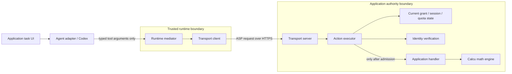

# SDK architecture proposal

Status: design draft, not an implemented API or a conformance claim.

The SDK should remove repeated ASP boundary code from applications without
absorbing their business logic or the agent's internal execution model. Start
with one Node.js package and one consumer (Calcu); extract demonstrated reuse
before adding platform abstractions or separate packages.

## What exists today

`JsonDocument`, `CanonicalObjectHash`, and `SurfaceSnapshot` implement strict JSON
input handling and selected canonical hashing behavior. `SurfaceSnapshot.hash()`
does not validate a full manifest or grant authority. Hash equality alone does
not authenticate a publisher, authorize an action, or prove user intent.

[spec-lock.json](../spec-lock.json) pins ASP revision
`951871c2d55db25d35512f29cc0970c69aa5cfd9` and currently digests only the evidence
module. Before implementing additional contracts, explicitly extend the lock's
source coverage and its validator/tests in a compatibility-reviewed change.
Do not silently advance the pinned revision or claim that the current lock
covers all future components.

## Target execution boundary

The following components are proposed roles, not existing exports. Arrows are
calls; results return along the same path, including executor to mediator and
mediator to agent adapter.

Issuance is a separate control path: a trusted application authorization decision
feeds the Grant issuer, which verifies evidence and establishes authoritative
Grant/session state. A credential reaches the trusted runtime over the chosen
provisioning channel, never via tool arguments or the task UI. The issuer is not
an agent-callable tool; the SDK cannot manufacture user authorization.

For the initial Compatibility Bearer development profile, the trusted runtime
holds the raw credential and the application store keeps its verifier hash.
Transport sends the credential in the authorization header, not the JSON body.
This is not a promise about every future credential profile or production trust.

These module boundaries describe responsibilities, not a JavaScript sandbox.
The host must isolate untrusted agent code and protect the credential-bearing
runtime; a malicious dependency in the same privileged process is outside the
protection provided by TypeScript interfaces or private fields.

## Responsibilities and dependency direction

| Component | Responsibility | Must not do |
| --- | --- | --- |
| JSON / canonical values | Preserve raw input checks, select exact hash views and domains | Treat a valid hash as authority |
| Manifest / Grant objects | Validate supported wire contracts, retain immutable bindings | Pretend unsupported profiles were checked |
| Grant issuer | Apply trusted authorization policy and verified identity to issuance | Accept an agent-supplied identity string as evidence |
| Session / authority state | Own lifecycle, generation and quota across calls | Reset quota when a mediator is recreated |
| Action executor | Admit against current authority, schema and application policy; then dispatch | Trust the mediator's admission decision |
| Runtime mediator | Construct bound requests and validate result correlation/schema | Let tool arguments choose credential or authority tuple |
| Transport adapters | Enforce transport authentication, framing, limits and cancellation | Supply business authorization or evaluate inputs |
| Application handler | Implement domain behavior and application-state checks | Rely on model prose as approval |
| Agent adapter | Translate provider tool calls into the narrow mediator API | Import the application's handler or bypass transport |

Domain objects depend on narrow behavioral interfaces. Concrete transport,
storage, clock and identity-verification implementations depend on those
interfaces, not the other way around. A composition root in the host wires them
together. Do not build a global registry, service locator or generic plugin
framework for this first consumer.

Candidate internal areas are `json`, `surface`, `authorization`, `execution`,
`runtime`, `node`, and `testing`. These are organizational suggestions, not a
requirement for seven folders or seven npm packages. Existing exports remain
unchanged. Introduce subpath exports only with working code and import-boundary
tests; browser safety is not established by naming a folder `core`.

## Invariants before interfaces

1. Boundary decoding keeps protocol field names and rejects malformed inputs
   before domain behavior. Preserve caller-owned values. Serialize internally
   built, validated values only; serialization cannot recover invalid raw JSON
   that an earlier parser erased.
2. Issuance and execution independently establish their prerequisites. Identity
   verification includes profile, bindings, freshness and lifecycle; unavailable
   or unsupported evidence cannot silently become an active identity.
3. Admission binds subject, runtime, agent, audience, surface, Grant and current
   session generation. Revocation and quota live in application-owned state,
   not in per-request objects or model memory.
4. Separate admission decisions from mutation without creating a check/use gap.
   The authority state owner must serialize or atomically compare/commit the
   relevant generation and quota at the execution admission point. Async identity
   checks do not permit using an unchecked stale state afterward. Define that
   linearization point and in-flight cancellation semantics before implementing
   a storage interface; do not promise revocation reverses an already-run action.
5. An admission rejection does not call the handler. A malformed response can be
   rejected by the mediator after a handler has already run: this is a different
   failure stage and must not be reported as proof of zero execution.
6. A schema-valid, correlated response from the authenticated application is
   evidence about the admitted operation, not semantic equivalence to the
   natural-language task or independent proof of business correctness. Agent
   prose remains untrusted presentation. No task digest establishes equivalence.

Follow the [EO policy](engineering/elegant-objects.md): constructors capture
dependencies and values; explicit behavior performs validation and I/O. Prefer
small immutable objects and composition. Do not create classes solely to wrap
each field, use getter/setter DTOs as the domain model, or add `Manager`/`Utils`
layers. Names and interfaces are finalized with their first behavior tests.

## Calcu extraction map

The observed baseline is Calcu commit
`4866de0cd9984d333ba37301dabd911f1ec8c2a2`. These are extraction candidates, not
claims that its development implementation is a complete ASP implementation.

| Calcu source | Proposed treatment |
| --- | --- |
| `server/hash.ts` | First consumer of canonical hashing; keep byte/artifact hashing separate |
| `server/executor.ts` | Separate reusable binding/admission/lifecycle from calculator-specific policy and dispatch |
| `server/localBackend.ts` | Extract request correlation behavior; retain the typed calculation facade in Calcu |
| `server/transport.ts`, `server/httpsActionServer.ts` | Extract a selected Node transport profile after domain contracts stabilize |
| `server/identity.ts` | Define a verifier interface; keep ephemeral trust fixtures explicitly development-only |
| `server/calcu.ts` | Keep math, operation schema and domain validation in Calcu |
| `server/codexAdapter.ts`, `server/taskHost.ts`, task UI | Keep CLI lifecycle, hosting and UX outside the core |

Calcu's loopback-only limits, fixed action and short-lived in-memory grants are
profile/application choices, not universal defaults. A future production profile
must not inherit them accidentally. Avoid importing the whole executor unchanged
and renaming it an SDK.

## Delivery sequence and exit criteria

1. **Consume the foundation in Calcu.** Replace only matching canonical-hash
   behavior using a reproducibly pinned package artifact. Preserve hash vectors
   and all existing boundary tests. Do not replace byte hashing with JCS hashing.
   Acceptance: a real consumer uses the SDK without changing its ASP behavior.
2. **Specify the first supported boundary contract.** Inventory the exact
   manifest/Grant/session fields and upstream evidence for Calcu's development
   profile. Extend source locking explicitly; implement immutable validated
   objects with positive and negative fixtures. Acceptance: valid hashes with
   invalid bindings/profile/schema are rejected at the appropriate boundary.
3. **Extract authority and execution behavior.** Add the issuer/executor and
   narrowly scoped state/verifier interfaces; first storage is in-memory.
   Acceptance: rejected admissions make zero handler calls; revocation,
   generation and concurrent quota tests hold across mediator recreation.
4. **Extract mediator and Node HTTPS binding.** Keep credentials server-only and
   preserve transport limits and correlation checks. Acceptance: Calcu round
   trip plus forged response, timeout, abort and invalid TLS tests pass; document
   explicitly that a lost response does not prove the action never executed.
5. **Measure before expanding.** Compare Calcu-specific code, setup steps and
   test burden before/after extraction. Try a second small consumer before a
   generic adapter framework. Browser support, additional packages and platforms
   require demonstrated needs rather than speculative API hooks.

Each step is a focused PR, not permission to implement all roles now. Report
supported behavior and evidence separately from maturity/conformance claims.
The first target remains Compatibility Bearer development usage. Production
identity, Proof-Bound profiles, receipts, approvals and side-effecting execution
need their own contract and tests before the SDK advertises them.

Keep SDK entry points provider-neutral. A future Codex adapter can be an optional
integration, but model names, reasoning effort, CLI versions and task parsing are
not ASP domain invariants. Likewise, JS is not a normative source for future Go,
Rust or Swift implementations; shared contracts and vectors belong upstream.
